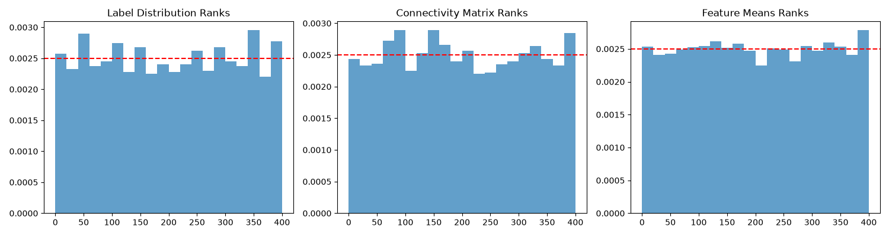

# Collapsed Gibbs Sampler for a mixture of CSBMs 

A Collapsed Gibbs Sampler (CGS) for a partially labelled mixture of Contextual Stochastic Block Models (CSBM) with conjugate priors. 

Let $(G, X, Y)$ be a graph $G$ with node features $X$ and labels $Y$ that is drawn from 

$$
    P(G, X, Y) = \int P(G, X, Y | \theta) \pi(\theta) \mathrm{d}\theta. 
$$

We observe $(G, X, Y_{U} \cup Y_{L})$, with $Y_{L}$ representing the labelled nodes and $Y_{U}$ their unlabelled counterparts. 
Our objective is to sample from the posterior over $Y_{U}, \theta$ given the above model, defined as 

$$
    \pi(\theta, Y_{U} | Y_{L}, G, X) \propto q(Y_{U}, Y_{L} | \theta) \cdot q(G | Y_{U}, Y_{L}, \theta) \cdot q(X | Y_{U}, Y_{L}, \theta) \cdot \pi(\theta). 
$$

This distribution is generally intractable.
We instead construct a Collapsed Gibbs Sampler that iteratively updates $\theta$ and $Y_{U}$.  

## Simulation-Based Calibration (SBC) 

We use Simulation-Based Calibration (SBC) to assess the quality of the CGS sampler.
The results are shown in the next figure. 

